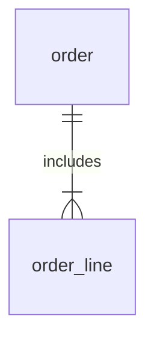

# Odoo PO and POLine integration test


## setup

Ce code de test utilise Odoo en local via docker compose
lors de la première connexion, un user admin est créé et ses identifiant et mot de passe sont renseigné dans un fichier `env`

pour lancer odoo: `docker compose up -d`

## connexion à l'api Odoo
L'api Odoo utilise un user et son mot de passe (ou une apikey lié à cet utilisateur à la place du mot de passe).
Il est recommandé de créer un utilisateur dédié (qui servira de compte de service).


## Exploration of Odoo API

l'api Odoo est composée de models et de fields, on peut lister les modèles via l'api.  
Exemple:
`res = models.execute_kw(db, uid, password, 'ir.model', 'fields_get', [], {'attributes': ['string', 'help', 'type']})`
ce qui a pour but de lister tous les champs de tous les modèles. (cf ./test/models.json)

Sur cette base on peut consulter plus précisément le modèle `purchase.order` et par exemple chercher tous les PO dont la date d'approbation est >= t
```python
purchase_ids = models.execute_kw(db, uid, password, 'purchase.order', 'search', [[['date_approve', '>=', '2020-01-01']]]) 
purchase_records = models.execute_kw(db, uid, password, 'purchase.order', 'read', [purchase_ids])
```
A noter que cela se passe en deux étapes:
- récupération de la liste des Ids
- lecture des objets sur la base de cette liste

pour consulter la remontée: ./test/po.json

### consultation des données du PO
Etant donné la relation de composition entre purchase.order et purchase.order.line


Il faut aller tirer les informations pertinentes de chaque ligne:

```python
# get the order lines for PO #9
purchase_detail_id = models.execute_kw(db, uid, password, 'purchase.order.line', 'search', [[['order_id', '=', 9]]]) 
purchase_detail_records = models.execute_kw(db, uid, password, 'purchase.order.line', 'read', [purchase_detail_id], {'fields': ['name', 'product_qty', 'qty_received']})
```
Output:
`[{'id': 9, 'name': '[E-COM07] Large Cabinet', 'product_qty': 7.0, 'qty_received': 0.0}]`


# for a full stack approach 

export KEY_VAULT_URL="https://your-key-vault-name.vault.azure.net/"
create secrets with names like:

apiUrl
storageAccountName
storageAccountKey
storageContainerName
deltaTablePath

locally: az login
on the VM use the managed identity

see src/full_stack_ingest.py file for a template with rest => az data lake gen 2